

<!-- _paginate: skip -->

# BATS

Bridging Acoustic Transparency in Speech

**Autores**: Felipe Cisternas y Diego Quezada
**Profesora**: Raquel Pezoa

---
<!-- _paginate: skip -->
# Contenido

1. Definición del problema.
2. Marco teórico.
3. Trabajo relacionado
4. Propuesta de solución.
5. Resultados.
6. Conclusiones.
7. Referencias.

---
<!--_header: Definición del problema-->
# 1. Definición del problema

* Modelos del estado del arte en tareas de ASR son cajas negras.
* La naturaleza física de los datos agrega una capa adicional de complejidad.

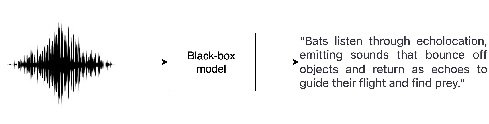

**Figura 1**: Esquema de un sistema de reconocimiento de voz.

---
<!--_header: Definición del problema-->
## 1.1 Motivación

* Librerías como LIME, SHAP, Captum, etc, no permiten explicar modelos de ASR.
* **FM TEXT**: Hacer accesible la radio a personas sordas.
* ¿Cómo mejorar la transparencia y la comprensión de estos modelos?

---
<!--_header: Marco teórico-->

# 2. Marco teórico

1. Speech recognition.
2.  Representación del sonido (señal, espectrograma, y mfcc).
3. Métricas de evaluación.
4. Open ASR Leaderboard.
5. Whisper.

---
<!--_header: Marco teórico-->
## 2.1 Speech recognition

Considerando:

* $\mathbf{X} = (x^{(1)}, x^{(2)} ,\dots, x^{(T)})$: una secuencia de audio de largo $T$ 
* $\mathbf{y} = (y_1, y_2, \dots, y_N)$: una secuencia de palabras de largo $N$.
* $P$: Distribución de probabilidad condicional que relaciona $\mathbf{X}$ con $\mathbf{y}$.

La tarea de reconocimiento de voz se define como:

$$
    f^\ast(\mathbf{X}) = \argmax_{\mathbf{y}} P(\mathbf{y}| \mathbf{X} = X)
$$

---

<!--_header: Marco teórico-->
## 2.2 Representación del sonido

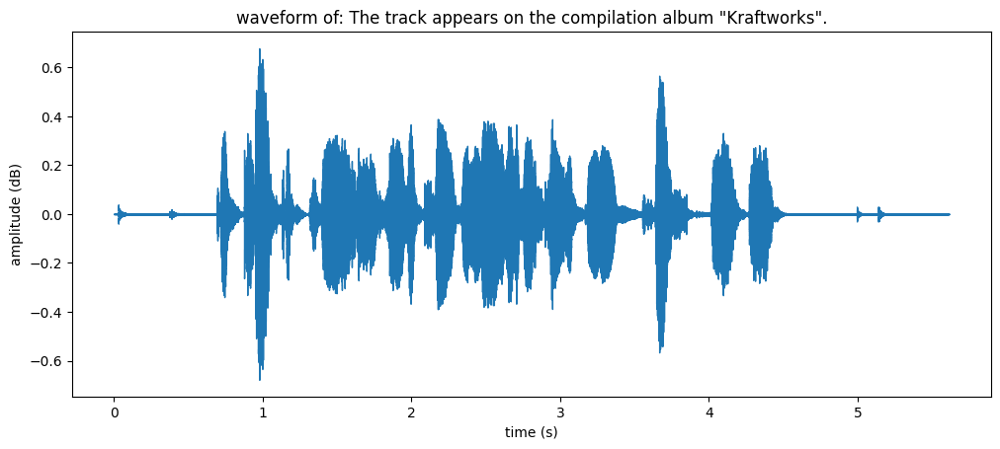 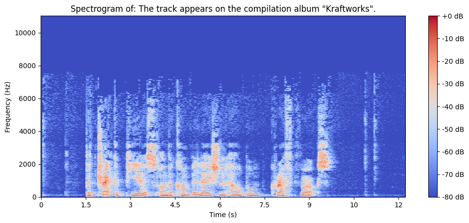

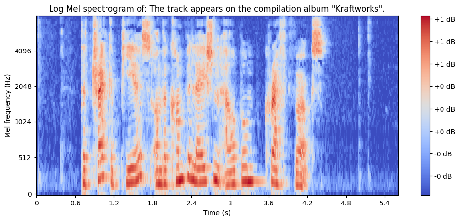

**Figura 2**: Distintas representaciones del sonido.
(Waveform, Spectogram and Log Mel Spectogram)

---
<!--_header: Marco teórico-->
## 2.3 Métricas de evaluación

Considerando la siguiente notación:

* $S$: número de sustituciones.
* $D$: número de eliminaciones
* $I$: número de inserciones
* $N$: número de palabras en la referencia
* $C$: número de palabras correctas
* $P$: número de palabras en la predicción.

---
<!--_header: Marco teórico-->
Podemos definir las siguientes métricas:

* WER (Word Error Rate) $= \frac{S + D + I}{N}$
* MER (Match Error Rate) $= \frac{S + D + I}{S + D + C}$
* WIL (Word Information Loss) $= 1 - \frac{C}{N} + \frac{C}{P}$
* WIP (Word Information Preserved) $= \frac{C}{N} + \frac{C}{P}$
* CER (Character Error Rate) $= \frac{S + D + I}{N}$

> CER considera $P$ como el número de caracteres en vez de palabras.

---
<!--_header: Marco teórico-->
## 2.4 Open ASR Leaderboard

* Competencia basada en el paper **ESB: A Benchmark For Multi-Domain End-to-End Speech Recognition (Sanchit et al. 2022).**
* Metricas Evaluadas:
  * WER (Word Error Rate).
  * RTF (Real Time Factor).

---

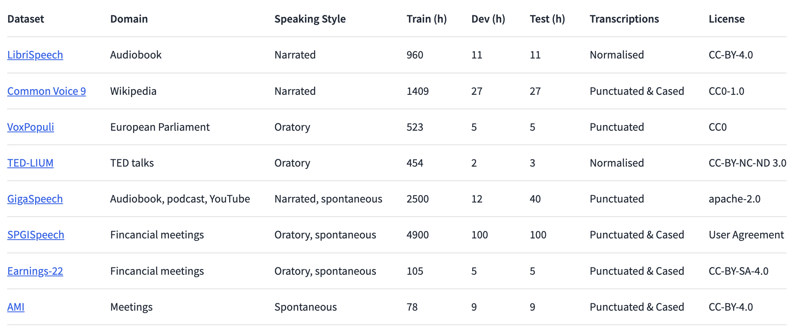

**Figura 3**: Datasets ESB.

---

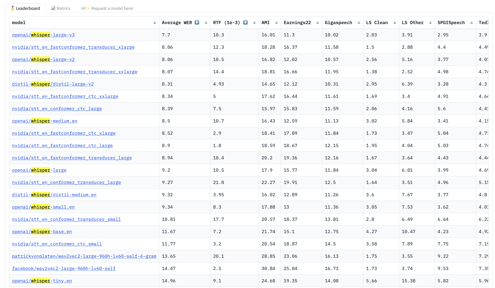

**Figura 4**: Open ASR Leaderboard, Fuente: Hugginface

---

<!--_header: Marco teórico-->
## 2.5 Whisper

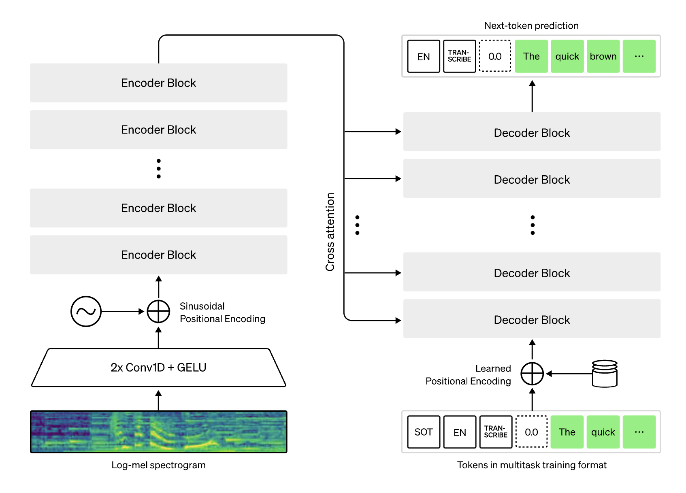

**Figura 5**: Arquitectura Whisper, Fuente: OpenAI

---
<!--_header: Trabajo relacionado -->
# 3. Trabajo relacionado

Se han propuesto explicaciones para distintas tareas:

* **Reconocimiento de voz**: Segmentos de audio que son causas mínimas y suficientes.
* **Reconocimiento de fonemas**: Importancia de segmentos de audio.
* **Etiquetado de música**: Importancia de fuentes de audio.

---
<!--_header: Trabajo relacionado -->

| Publicación        | Tarea         | Métodos       |
|----------------|---------------|---------------|
| X. Wu, et al. (2020) | Reconocimiento de voz | SFL, Causal, LIME (*) |
| Haunschmid, et al. (2020) | Etiquetado de música | LIME (*) |
| X. Wu, et al. (2023) | Reconocimiento de fonemas | LIME (*) |

**Tabla 1**: Resumen de trabajos relacionados

> (*) Versión modificada de LIME.

---
<!--_header: Propuesta de solución-->
# 4. Propuesta de solución

El entorno de experimentación se define a continuación:

* Conjunto de datos: Common Voice 11.
* Modelo: Whisper versión Tiny.
* CPU: Apple M1 Pro 10 Cores.
* GPU: Apple GPU 16 Cores.
* RAM: 16GB LPDDR5.
* OS: macOS 14.0.
* Software: Python 3.10, PyTorch 2.1.0

---
<!--_header: Propuesta de solución-->
## 4.1 SLIME

* Representación: Vector booleano para ausencia o presencia de un segmento.
* Vecindad: Muestra aleatoria de una distribución binomial con probabilidad $p = 0.5$.
* Modelo interpretable: Regresión lineal o árbol de decisión.
* Tarea: Predicción Distancia de Levenshtein respecto a la transcripción original.
* Explicación: Coeficientes asociados a cada segmento.

---
<!--_header: Propuesta de solución-->

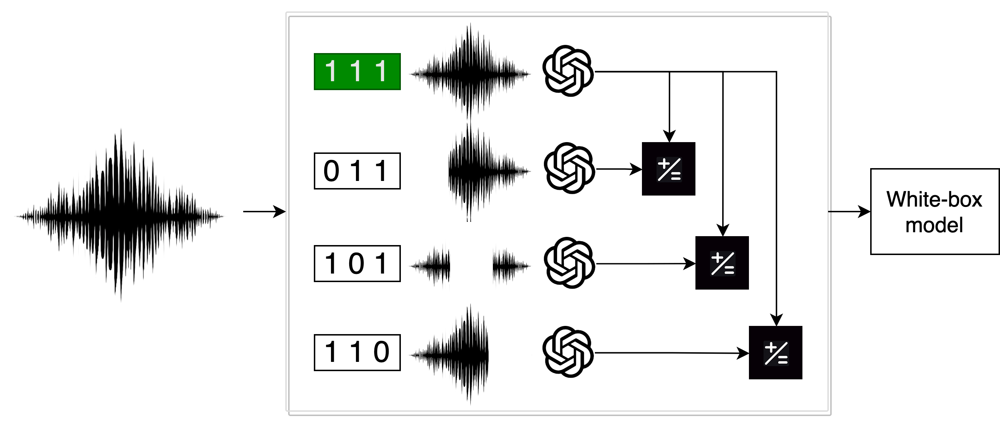

**Figura 6**: SLIME.

---
<!--_header: Propuesta de solución-->
## 4.2 Borrado de representaciones

* Representación: Espectrograma de MEL (80,3000).
* Calculo de importancia: WER, MER, WIL, WIP, CER
* Comparación entre espectrograma original y espectrograma con dimensiones borradas.
* $I(d) = \frac{1}{|E|} \sum_{x \in E} \frac{S_{M}(x,y) - S_{M}(x,y,\neg d)}{S_{M}(x,y)}$
* Expliación: Bandas de frecuencia más importantes.

---
<!--_header: Propuesta de solución-->

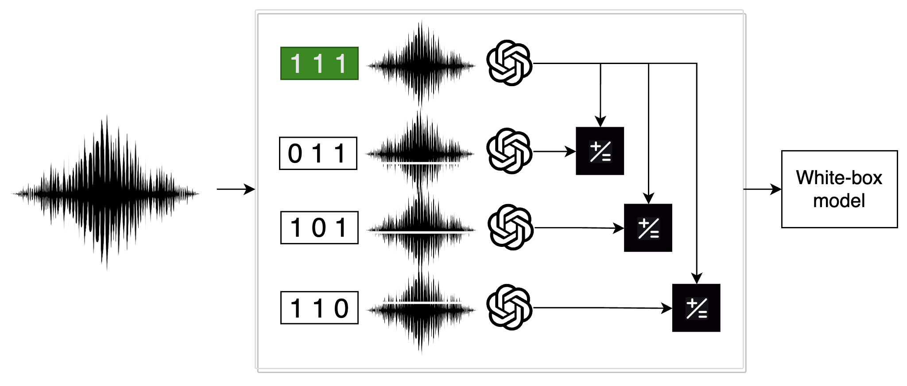 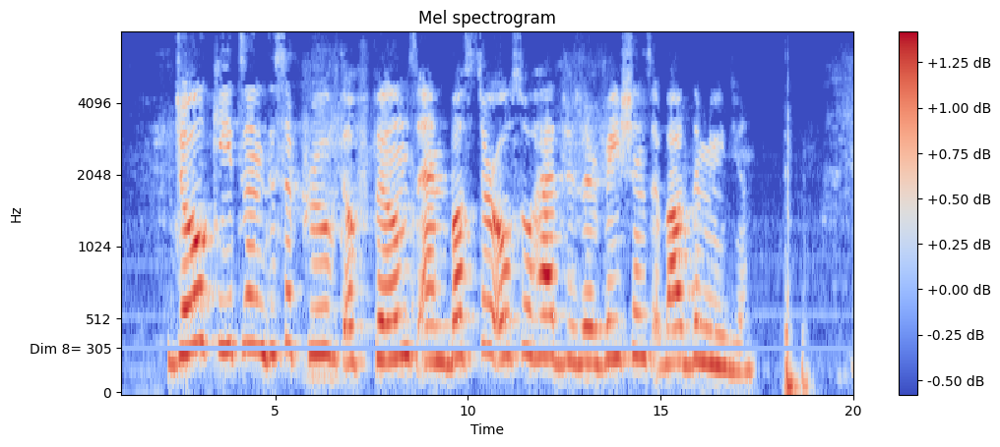

**Figura 7**: Borrado de Representaciones y Ejemplo con un Espectrograma Real.

---
<!--_header: Resultados-->
# 5. Resultados

---
<!--_header: Resultados-->
## 5.1 SLIME

* $y:$ *it is a busy market town that serves a large surrounding area*.
* $y^\prime:$ *it is a busy market town that serves a large **surrounded** area*.
* A continuación, se explica la transcripción de Whisper usando SLIME.

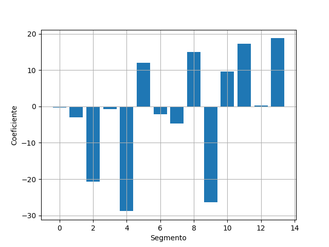

**Figura 8**: Coeficientes Regresión Lineal

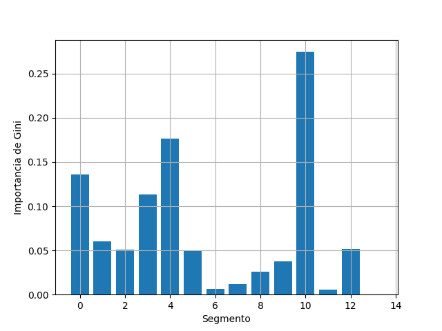

**Figura 9**: Importancia de Gini

---
<!--_header: Resultados-->
## 5.2 Representation Erasure

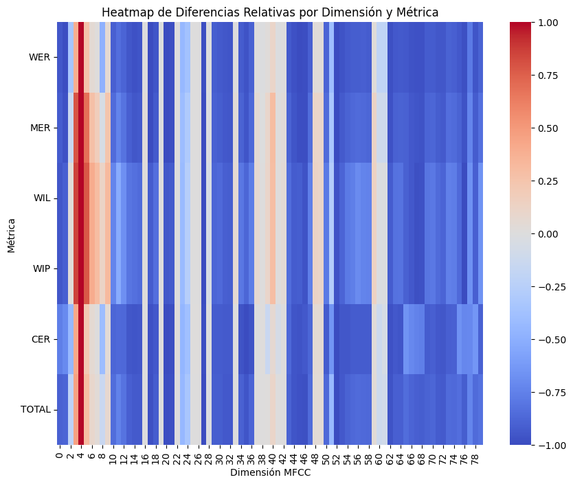

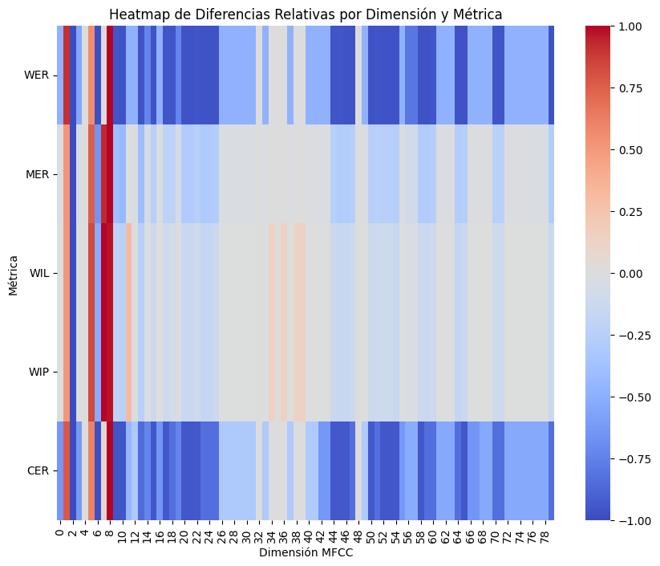

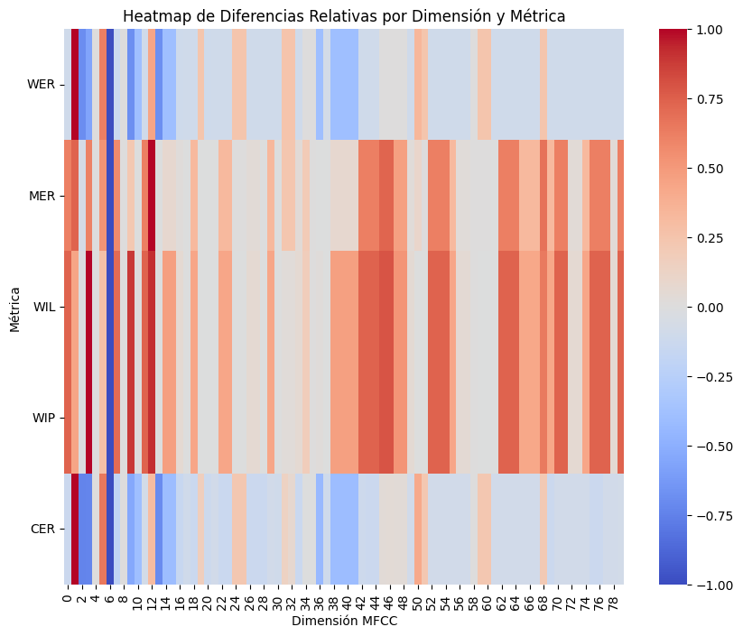

**Figura 10**: Importancia de las dimensiones del espectrograma

> En la primera visualización se consideran todas las dimensiones.
En la segunda se elimina la dimensión 4 y en la tercera la dimensión 4 y 8.

---
# 6. Conclusiones
<!--_header: Conclusiones-->

* Se estudió la explicabilidad de Whisper: un modelo del estado del arte en reconocimiento de voz. 
* Se propuso SLIME: una adaptación de LIME para el reconocimiento de voz inspirada en LIME-TS (X. WU, et al. 2023).
* SLIME provee explicaciones escuchables.
* SLIME destaca la importancia de cada segmento de audio.
* *Representation erasure* provee explicaciones visuales.
* *Representation erasure* evidencia la importancia de las frecuencias bajas.

----
<!--_header: Conclusiones-->
## 6.1 Trabajo futuro

Como trabajo futuro se propone:

* BATS: Librería para explicar modelos de ASR.
* Aprendizaje reforzado para aprender la mejor representación de los datos.

---
<!-- _paginate: skip -->

# 7. Referencias

1. Wu, X., Bell, P., & Rajan, A. (2023). Explanations for Automatic Speech Recognition. In *ICASSP 2023 - 2023 IEEE International Conference on Acoustics, Speech and Signal Processing (ICASSP)* (pp. 1-5). doi: 10.1109/ICASSP49357.2023.10094635.
2. Wu, X., Bell, P., & Rajan, A. (2023). Can We Trust Explainable AI Methods on ASR? An Evaluation on Phoneme Recognition. arXiv:2305.18011 [cs.CL].
3. Haunschmid, V., Manilow, E., & Widmer, G. (2020). audioLIME: Listenable Explanations Using Source Separation. *CoRR*, vol. abs/2008.00582. Retrieved from https://arxiv.org/abs/2008.00582

---

4. Radford, A. et al. (2022). Robust Speech Recognition via Large-Scale Weak Supervision.
5. Li, J. et al. (2017). Understanding Neural Networks through Representation Erasure.
6. Gandhi, S. et al. (2022). ESB: A Benchmark For Multi-Domain End-to-End Speech Recognition.

---

<!-- _paginate: skip -->

Muchas gracias por su atención.

