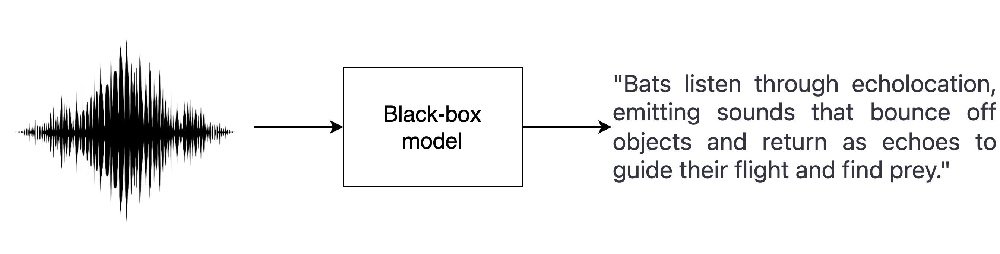
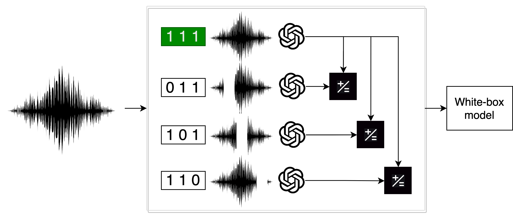

<!-- _paginate: skip -->

# BATS

Bridging Bridging Acoustic Transparency in Speech

**Autores**: Felipe Cisternas y Diego Quezada
**Profesora**: Raquel Pezoa

---
<!-- _paginate: skip -->
# Contenido

1. Definición del problema.
2. Marco teórico.
3. Trabajo relacionado
4. Propuesta de solución.
5. Validación de la propuesta.
6. Conclusiones.

---
<!--_header: Definición del problema-->
# 1. Definición del problema

* Modelos del estado del arte en tareas de ASR son cajas negras.
* La naturaleza física de los datos agrega una capa adicional de complejidad.

**Figura 1**: Esquema de un sistema de reconocimiento de voz.

---
<!--_header: Definición del problema-->
## 1.1 Motivación

* Librerías como LIME, SHAP, Captum, etc, no permiten explicar modelos de ASR.
* **FM TEXT**: Hacer accesible la radio a personas sordas.
* ¿Cómo mejorar la transparencia y la comprensión de estos modelos?

---
<!--_header: Marco teórico-->

# 2. Marco teórico

Agregar lo siguiente:

1. Speech recognition.
2. Métricas de evaluación.
3. Representación del sonido (señal, espectrograma, y mfcc).
4. Whisper.
5. Opcional: LIME y borrado de representaciones.

**TODO MUY BREVE**

---
<!--_header: Trabajo relacionado -->

# 3. Trabajo relacionado

---
# 4. Propuesta de solución

* Conjunto de datos: Common Voice.
* Modelo: **Whisper**, versión Tiny.

---
<!--_header: Propuesta de solución-->
## 4.1 SLIME

* Representación: Vector booleano para ausencia o presencia de un segmento.
* Vecindad: Muestra aleatoria de una distribución binomial con probabilidad $p = 0.5$.
* Modelo interpretable: Regresión lineal o árbol de decisión.
* Tarea: Predicción Distancia de Levenshtein respecto a la transcripción original.
* Explicación: Coeficientes asociados a cada segmento.

---

**Figura 2**: SLIME.

---
<!--_header: Propuesta de solución-->
## 4.2 Borrado de representaciones

---
# 5. Validación de la propuesta

---
# 6. Conclusiones

----

Como trabajo futuro se propone:

* BATS: Librería para explicar modelos de ASR.
* Aprendizaje reforzado para aprender la mejor representación de los datos.

---
<!-- _paginate: skip -->

Muchas gracias por su atención.

---
# Anexos

