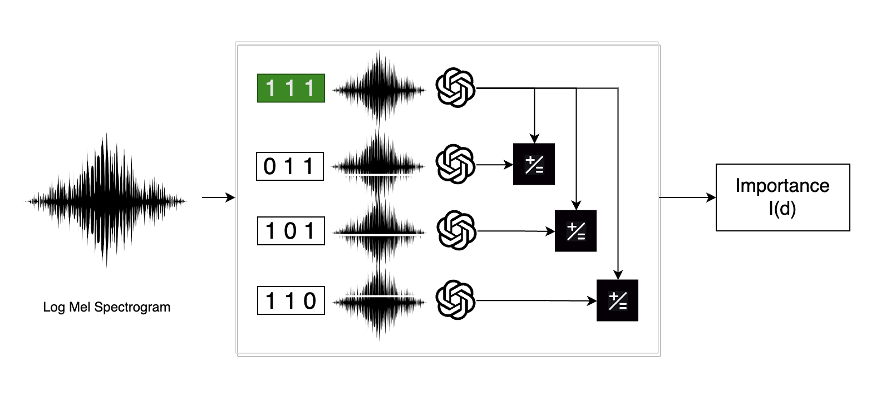

<!-- _paginate: skip -->

# BATS

Bridging Bridging Acoustic Transparency in Speech

**Autores**: Felipe Cisternas y Diego Quezada
**Profesora**: Raquel Pezoa

---
<!-- _paginate: skip -->
# Contenido

1. Definición del problema.
2. Marco teórico.
3. Trabajo relacionado
4. Propuesta de solución.
5. Validación de la propuesta.
6. Conclusiones.

---
<!--_header: Definición del problema-->
# 1. Definición del problema

* Modelos del estado del arte en tareas de ASR son cajas negras.
* La naturaleza física de los datos agrega una capa adicional de complejidad.

**Figura 1**: Esquema de un sistema de reconocimiento de voz.

---
<!--_header: Definición del problema-->
## 1.1 Motivación

* Librerías como LIME, SHAP, Captum, etc, no permiten explicar modelos de ASR.
* **FM TEXT**: Hacer accesible la radio a personas sordas.
* ¿Cómo mejorar la transparencia y la comprensión de estos modelos?

---
<!--_header: Marco teórico-->

# 2. Marco teórico

1. Speech recognition.
2. Métricas de evaluación.
3. Representación del sonido (señal, espectrograma, y mfcc).
4. Whisper.

---
## 2.1 Speech recognition

* Sea $\mathbf{X} = (x^{(1)}, x^{(2)} ,\dots, x^{(T)})$ una secuencia de audio de largo $T$ e $y = (y_1, y_2, \dots, y_N)$ una secuencia de palabras de largo $N$.
* La tarea de reconocimiento de voz se define como:

$$
    f^\ast(\mathbf{X}) = \argmax_{\mathbf{y}} P^\ast(\mathbf{y}| \mathbf{X} = X)
$$

* Donde $P^\ast$ es la verdadera distribución de probabilidad condicional que relaciona las entradas $\mathbf{X}$ con las salidas $\mathbf{y}$.

---

## 2.2 Métricas de evaluación

- WER (Word Error Rate) $= \frac{S + D + I}{N}$
- MER (Match Error Rate) $= \frac{S + D + I}{S + D + C}$
- WIL (Word Information Loss) $= 1 - \frac{C}{N} + \frac{C}{P}$
- WIP (Word Information Preserved) $= \frac{C}{N} + \frac{C}{P}$
- CER (Character Error Rate) $= \frac{S + D + I}{N}$

Donde $S$ es el número de sustituciones, $D$ es el número de eliminaciones, $I$ es el número de inserciones, $N$ es el número de palabras en la referencia, $C$ es el número de palabras correctas y $P$ es el número de palabras en la predicción. (Para CER en vez de palabras se usan caracteres). 

---

## 2.3 Representación del sonido

 

**Figura 2**: Distintas representaciones del sonido.
(Waveform, Spectogram and Log Mel Spectogram)

---

## 2.4 Whisper

**Figura 3**: Arquitectura Whisper, Fuente: OpenAI

---
<!--_header: Trabajo relacionado -->

# 3. Trabajo relacionado

Se han propuesto explicaciones para distintas tareas:

* **Reconocimiento de voz**: Segmentos de audio que son causas mínimas y suficientes.
* **Reconocimiento de fonemas**: Importancia de segmentos de audio.
* **Etiquetado de música**: Importancia de fuentes de audio.

---

| Publicación        | Tarea         | Métodos       |
|----------------|---------------|---------------|
| X. Wu, et al. (2020) | Reconocimiento de voz | SFL, Causal, LIME (*) |
| Haunschmid, et al. (2020) | Etiquetado de música | LIME (*) |
| X. Wu, et al. (2023) | Reconocimiento de fonemas | LIME (*) |

**Tabla 1**: Resumen de trabajos relacionados

> (*) Versión modificada de LIME.

---
# 4. Propuesta de solución

* Conjunto de datos: Common Voice 11.
  * Los conjunto de entrenamiento, validación y prueba consisten en **948.736**, **16.354** y **16.354** grabaciones de audio, que corresponden al **96\%**, **2\%** y un **2\%** de los datos respectivamente. Cada grabación de audio tiene asociada una transcripción. Adicionalmente, cada grabación de audio fue grabada con un **sampling rate** de 48 kHz.
* Modelo: **Whisper**
  * versión Tiny.
  * 39 M de parámetros.
  * Lenguaje: Ingles (en).

---
<!--_header: Propuesta de solución-->
## 4.1 SLIME

* Representación: Vector booleano para ausencia o presencia de un segmento.
* Vecindad: Muestra aleatoria de una distribución binomial con probabilidad $p = 0.5$.
* Modelo interpretable: Regresión lineal o árbol de decisión.
* Tarea: Predicción Distancia de Levenshtein respecto a la transcripción original.
* Explicación: Coeficientes asociados a cada segmento.

---

**Figura 4**: SLIME.

---
<!--_header: Propuesta de solución-->
## 4.2 Borrado de representaciones

* Representación: Espectrograma de MEL (80,3000).
* Calculo de importancia: WER, MER, WIL, WIP, CER
* Comparación entre espectrograma original y espectrograma con dimensiones borradas.
* $I(d) = \frac{1}{|E|} \sum_{x \in E} \frac{S_{M}(x,y) - S_{M}(x,y,\neg d)}{S_{M}(x,y)}$
* Expliación: Bandas de frecuencia más importantes.

---

 
**Figura 5**: Borrado de Representaciones y Ejemplo con un Espectrograma Real.

---
# 5. Validación de la propuesta

---
## 5.1 SLIME

---
## 5.1 Representation Erasure

  
**Figura 6**: Importancia de las dimensiones del espectrograma, primero con todas las dimensiones, luego con las dimensiones 4 borradadas y finalmente con las dimensiones 4 y 8 borradas.

---
# 6. Conclusiones

----

## 6.1 Trabajo futuro

Como trabajo futuro se propone:

* BATS: Librería para explicar modelos de ASR.
* Aprendizaje reforzado para aprender la mejor representación de los datos.

---
<!-- _paginate: skip -->

Muchas gracias por su atención.

---
# Anexos

